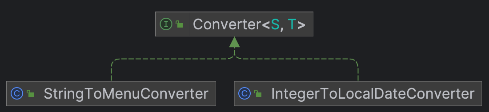

# 크리스마스 프로모션
## 기능 목록
- [x] 프로모션 진행 시 필요한 설정값을 관리한다. - `PromotionConfig`
- [x] 예외 상황시 발생시킬 예외 클래스를 생성한다. - `InputException`
  - [x] 예외 메시지는 열거체로 관리한다. `ErrorCode`
- [x] 방문 날짜를 입력받는다. - `InputView.requestVisitDay()`
  - [x] 숫자가 아닌 경우 예외 발생 - `ConsoleInputView.validateVisitDayNumeric()`
- [x] 입력값을 요일, 날짜 객체로 변환한다. - `IntegerToLocalDateConverter.convert()`
  - [x] 12월에 해당되는 날이 아닌 경우 예외 발생 - `VisitDateValidator.validate()`
- [x] 변환한 값을 통해 도메인을 생성한다. - `VisitDateGenerator.generate()`
- [x] 주문 메뉴와 개수를 입력받는다. - `InputView.requestOrders()`
  - [x] 메뉴 이름, 수량 구분자(`-`)가 포함되지 않는 경우 예외 발생 - `ConsoleInputView.validateOrderContainSeparator()`
  - [x] 수량이 숫자가 아닌 경우 예외 발생 - `ConsoleInputView.validateMenuQuantityNumeric()`
- [x] 입력받은 메뉴명을 열거체로 변환한다. - `StringToMenuConverter.convert()`
  - [x] 메뉴판에 없는 메뉴명 입력 시 예외 발생 - `MenuValidator.validate()`
- [x] 변환한 값과 입력받은 수량을 통해 도메인을 생성한다. `OrdersGenerator.generate()`
  - [x] 각각의 주문 수량이 1개 미만인 경우 예외 발생 - `QuantityValidator.validate()`
  - [x] 총 수량이 20개 보다 큰 경우 예외 발생 - `OrdersValidator.validateTotalQuantity()`
  - [x] 메뉴명 중복시 예외 발생 - `OrdersValidator.validateDuplicate()`
  - [x] 음료만 입력시 예외 발생 - `OrdersValidator.validateMenuType()`
- [x] 주문 도메인에 적용되는 혜택 도메인을 생성한다. - `BenefitsGenerator.generate()`
  - [x] 총 주문 금액이 10,000원 미만인 경우 적용되는 혜택이 없다. - `BenefitsGenerator.avaliable()`
- [x] 주문, 혜택 도메인을 통해 예약 내역 도메인을 생성한다. - `PromotionService.createReservation()`
- [x] 총 혜택 금액을 통해 배지 도메인 생성한다. - `BadgeGenerator.generate()`
- [x] 배지, 예약 내역을 통해 사용자 도메인을 생성한다. - `PromotionService.createUser()`
- [x] 예약 내역 도메인을 통해 아래 내역을 출력하기 위한 객체를 생성한다.
  - [x] 주문 내역 - `OrderResponseMapper.map()`
  - [x] 혜택 내역 - `BenefitResponseMapper.map()`
  - [x] 방문 날짜 - `VisitDateResponseMapper.map()`
- [x] 사용자 도메인을 통해 배지 내역을 출력하기 위한 객체를 생성한다. - `BadgeResponseMapper.map()`
- [x] 생성한 객체를 View에서 출력한다.
  - [x] 총 주문 현황 - `OutputView.printOrderMessage()`
  - [x] 적용 혜택 - `OutputView.printBenefitMessage()`
  - [x] 부여받은 이벤트 배지 - `OutputView.printBadgeMessage()`

## 기능 요구 사항
방문 날짜, 주문 메뉴 및 수량을 입력받아 프로모션을 적용한 주문 내역을 출력하는 프로그램이다. 방문 날짜, 주문 내역에 따라 다양한 프로모션 혜택이 적용된다. 

주문을 하기 위해선 다음 조건을 만족해야 한다.
- 음료만 주문할 수 없다.
- 주문 수량은 최소 1개 ~ 20개이다.

`(메뉴명)-(수량)` 형태로 주문을 받으며 쉼표(`,`)로 구분하여 여러 메뉴를 주문할 수 있다. 이 때, 각각의 메뉴명은 중복될 수 없다.

프로모션 혜택은 총 주문 금액이 10,000원 이상부터 적용받으며 중복 적용이 가능하다. 
방문 날짜, 주문 메뉴에 따라 다양한 혜택이 적용된다.

| 혜택 이름  |    방문 날짜 조건    |       주문 금액 조건       |              적용 혜택              | 
|:------:|:--------------:|:--------------------:|:-------------------------------:| 
| 디데이 할인 |  12/1 ~ 12/25  |          X           | 1,000 + 100 * ((방문 날짜) - 1)원 할인 |
| 평일 할인  |  매주 일요일 ~ 목요일  |          X           |      디저트 메뉴 1개당 2,023원 할인       |
| 주말 할인  |  매주 금요일, 토요일   |          X           |       메인 메뉴 1개당 2,023원 할인       |
| 특별 할인  | 매주 금요일 + 크리스마스 |          X           |            1,000원 할인            |
| 증정 이벤트 |       X        | 총 주문 금액이 120,000원 이상 |            샴페인 1개 증정            |


혜택받은 금액에 따라 내년 새해 이벤트에 사용될 배지도 부여한다.

|배지 이름| 최소 혜택 금액 |
|:---:|:---------|
|별| 5,000원   |
|트리| 10,000원  |
|산타|20,000원|

사용자는 아래와 같이 주문, 혜택 내역 및 예상 결제 금액을 확인할 수 있다. 

(e.g. 12월 5일에 방문하고 해산물파스타 2개, 레드와인 1개, 초코케이크 1개를 주문하는 경우)
```
안녕하세요! 우테코 식당 12월 이벤트 플래너입니다.
12월 중 식당 예상 방문 날짜는 언제인가요? (숫자만 입력해 주세요!)
5
주문하실 메뉴를 메뉴와 개수를 알려 주세요. (e.g. 해산물파스타-2,레드와인-1,초코케이크-1)
해산물파스타-2,레드와인-1,초코케이크-1
12월 5일에 우테코 식당에서 받을 이벤트 혜택 미리 보기!

<주문 메뉴>
해산물파스타 2개
초코케이크 1개
레드와인 1개

<할인 전 총주문 금액>
145,000원

<증정 메뉴>
샴페인 1개

<혜택 내역>
크리스마스 디데이 할인: -1,400원
평일 할인: -2,023원
증정 이벤트: -25,000원

<총혜택 금액>
-28,423원

<할인 후 예상 결제 금액>
141,577원

<12월 이벤트 배지>
산타
```

## 클래스 다이어그램


### Benefit
<p align="center">
  
</p>

혜택을 크게 증정 이벤트, 할인 두 가지의 추상 클래스를 두고 각각 구현했다. 
증정 혜택의 경우 상품명, 수량을 필드를 추가하여 확장에 대비했다. 구현체는 혜택 적용 여부 및 가격 메서드를 구현하여 일급 컬렉션으로 관리된다.

추후, 다른 혜택이 추가되는 경우 종류에 따라 추상 클래스 형태에 알맞게 구현체를 작성하면 된다.


### Converter
<p align="center">
  
</p>

입력값을 특정 객체로 컨버팅시 사용되는 클래스들이다. 방문 날짜, 메뉴명을 컨버팅한다. 컨버팅된 값들은 도메인 객체를 생성할 때 사용된다.


### Validator
<p align="center">
  
</p>


입력값을 검증시 사용되는 클래스들이며 `Converter`, `Generator` 에서 사용된다. 검증 대상을 제네릭으로 추상화하였고, 구현체에서 이를 명시하여 특정 대상에 대한 검증을 수행한다. 각각은 수량, 방문 날짜, 메뉴, 메뉴 중복등을 검증하고 실패 시 예외를 발생시킨다.


### Mapper
<p align="center">
  
</p>

도메인 객체를 DTO 객체로 매핑시 사용되는 클래스들이다. 각각의 도메인을 혜택 및 주문 내역, 금액, 예상 방문 날짜들을 View에 전달 시 사용되는 DTO 객체로 매핑한다.

### Generator
<p align="center">
  
</p>

입력값을 통해 도메인 객체를 생성할 때 사용되는 클래스들이다. 특정 클래스는 `Validator`를 통한 검증을 수행한다.

`BenefitsGenerator`는 모든 혜택을 가지고 있으며 방문 날짜, 주문 내역에 따라 적용되는 혜택만 취합하여 `Benefits` 객체를 생성한다.

### View
<p align="center">
  
</p>

입/출력 View를 담당하는 클래스들이다. 필요한 상수, 추상 메서드를 정의한 인터페이스와 구현 클래스가 존재한다. 추후, 콘솔 외에 다른 매개체로 입/출력이 필요하므로 인터페이스를 사용했다.


### Domain
<p align="center">
  
</p>

비지니스 로직에 사용되는 도메인 클래스들이며, 요구 사항에 맞춰 설계를 진행했다. Getter 메서드를 최대한 지향하기 위해 클래스를 최대한 분리하려고 노력했다.

추후 진행되는 새해 이벤트(확장성)을 고려하여 배지는 사용자 도메인에 포함시켰다. 예약 내역은 혜택, 주문, 방문 날짜 3개로 구성되며 각각을 통해 사용자에게 예약 현황을 제공한다. 

주문 내역은 수량, 메뉴 두 가지로 구성된다. 수량은 검증 필요성에 의해 별도 객체로 분리했고, 메뉴의 경우 메뉴판에 있는 메뉴만 주문하도록 열거체로 구현했다.


### Service
<p align="center">
  
</p>
Service는 다음 3가지 기능을 한다.

- 입력값을 통한 도메인 객체 생성 
- 도메인을 통한 비지니스 로직 수행
- 최종적으로 만들어진 도메인을 View에 필요한 객체로 매핑

`Generator`, `Mapper` 에 대한 응집도 최대한 낮추기 위해 계층을 구분하였다. Controller에서 직접적으로 사용되는 Service(고수준), `Generator`, `Mapper` 에 사용되는 Service(저수준) 2가지로 구분하여 의존성을 낮추었다.

추후, DB 도입 시 고수준 Service에 트랜잭션을 적용한다면 여러 기능을 하나의 트랜잭션 단위로 동작이 가능하다.